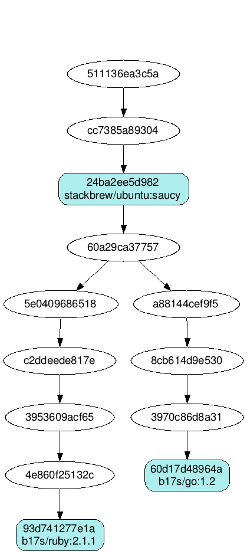
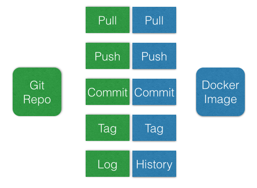
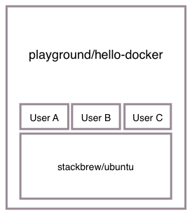

## Iteration 1

Let's explore some basic concepts of Docker.

### Docker Images 101

Docker Images are the key element of Docker and the base for every container you'll run. There is a public registry hosted by Docker called ```index```. You can find it over [here](https://index.docker.io). You'll find a bunch of publicly available images for pretty much everything you want (plain Ubuntu, Ruby, Python, PHP, etc). These are a good starting point to build your own container.

#### Layers

Docker images are basically stacked layers. You'll start with a base image, add some build tools, your interpreter and finally your app on top of that. Here's a schematic view taken from Docker:


Each layer stores only the diff of its filesystem to the parent. When you're familiar with Git, it's a pretty similar concept when you compare it to Git commits. Just keep in mind: It's a very efficient way of storing your container.

To make it a little bit clearer what's going on, let's take a look the following graph:



It visualizes two language specific images (Ruby & Go), which are based on Ubuntu Saucy. As you can see, both are sharing the same Ubuntu image. The unnamed commits in between are build steps on the way to the final image and can be ignored for now (we'll come back to this later).

#### Locally available images

We've prepared the Vagrant box with a few images so you won't have to download hundreds of Megabytes of data. Let's check:

```
docker images
```

You should see something along the lines of this:

```
REPOSITORY          TAG                 IMAGE ID            CREATED             VIRTUAL SIZE
dockerfile/redis    latest              b01b75039f13        12 weeks ago        561.9 MB
stackbrew/ubuntu    13.10               24ba2ee5d982        3 months ago        144.6 MB
stackbrew/ubuntu    saucy               24ba2ee5d982        3 months ago        144.6 MB
stackbrew/ubuntu    13.04               0e5997dad26c        3 months ago        133.6 MB
stackbrew/ubuntu    raring              0e5997dad26c        3 months ago        133.6 MB
stackbrew/ubuntu    12.10               ddc094db4e2b        3 months ago        127.6 MB
stackbrew/ubuntu    quantal             ddc094db4e2b        3 months ago        127.6 MB
stackbrew/ubuntu    12.04               3aa646e4f1d2        3 months ago        125.9 MB
stackbrew/ubuntu    latest              3aa646e4f1d2        3 months ago        125.9 MB
stackbrew/ubuntu    precise             3aa646e4f1d2        3 months ago        125.9 MB
```

Alright, but are these really different ubuntu systems there?

```
docker run --rm stackbrew/ubuntu:saucy lsb_release -a
```

Test it with another tag and see the difference yourself.

### Hello Docker Festival

Ok, let's create and share a simple image with our peers. 

#### Prepare

Let's add a simple file to one container (Don't forget to replace ```<YOUR-NAME>``` with your actual name)

```
docker run --name=hello-docker stackbrew/ubuntu:saucy /bin/bash -lc 'echo "Hello Docker from <YOUR-NAME>" > /hello-docker'
```

Note about flags:

- ```--name``` can be provided as a known identifier for the container. The name has to be unique. If it's omitted Docker will automatically generate a name

This commands runs the part after the image name (stackbrew/ubuntu:saucy) as command inside the container and exits immediately. Hence, we should have created a file inside the container.

#### Diff

Let's see if we've actually change something:

```
docker diff hello-docker
```

#### Commit & Tag

In order to share our hard work we have to commit the container to an image. As we want to refer to this commit by an easy to remember name, let's tag it with your name.

```
docker commit -a "<YOUR-NAME>" -m "Hello Docker" hello-docker playground/hello-docker:<YOUR-NAME>
```

Note:

- ```-a``` Author name
- ```-m``` Commit Message

#### Confirm

Before we are going to share this, let's confirm we've done everything right:

```
docker run --rm playground/hello-docker:<YOUR-NAME> cat /hello-docker
```

#### Share

Well done, time to share this our awesome image with everybody else.

```
docker push playground/hello-docker
```

This automagically works, as the Vagrant box is authenticated for the Docker Index as ```playground``` user already. You should be able to see your tag online here: https://index.docker.io/u/playground/hello-docker/tags/

Now let's see if anybody else has pushed his work already:

```
docker pull playground/hello-docker
```

And list only the images we're interested in

```
docker images playground/hello-docker
REPOSITORY                TAG                 IMAGE ID            CREATED             VIRTUAL SIZE
playground/hello-docker   john                98772ca78247        4 minutes ago       144.6 MB
playground/hello-docker   <YOUR-NAME>         64f602ceead7        12 minutes ago      144.6 MB
```

Sweet, John has pushed something. Let's check what he did:

```
docker run --rm playground/hello-docker:superman cat /hello-docker
```

### Recap

We've done basic operations around creating / sharing images via the Docker Index. When you're familiar with Git and Github, those concepts should be well known to you.



Furthermore, we've worked with the ```playground/hello-docker``` repository, which now contains a bunch of images. This concept will be quite useful later on.



So much for the first iteration. In the next one, we'll start with building a container for a simple Sinatra App (written in Ruby).