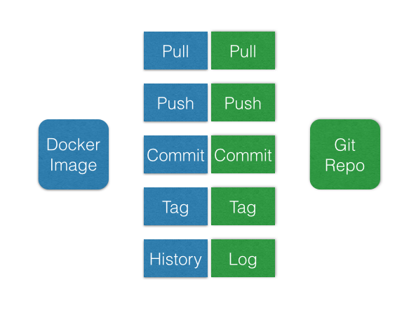

## Iteration 1

Let's explore some basic concepts of Docker.

### Docker Images

Docker Images are the key element of Docker and the base for every container you'll run. There is a public registry hosted by Docker called ```index```. You can find it over [here](https://index.docker.io). You'll find a bunch of publicly available images for pretty much everything you want (plain Ubuntu, Ruby, Python, PHP, etc). These are a good starting point to build your own container.

#### Layers

Docker images are basically stacked layers. You'll start with a base image, add some build tools, your interpreter and finally your app on top of that. Here's a schematic view taken from Docker:


Each layer stores only the diff of its filesystem to the parent. When you're familiar with Git, it's a pretty similar concept when you compare it to Git commits. Just keep in mind: It's a very efficient way of storing your container.

To make it a little bit clearer what's going on, let's take a look the following graph:


It visualizes two language specific images (Ruby & Go), which are based on Ubuntu Saucy. As you can see, both are sharing the same Ubuntu image. The unnamed commits in between are build steps on the way to the final image and can be ignored for now (we'll come back to this later).

#### The Registry (Index)

As mentioned above, Docker provides a registry. Let's do something useful. We're looking for a small linux distribution in the container. Let's open the registry web-site and look for ```busybox``` and see what it does.

https://index.docker.io

### Pull

As you've made yourself familiar with the ```busybox``` repository on the Docker index (e.g. it's an offical repository, hence you can trust it), let's play around with it.

```
docker pull busybox
```

### Run

Awesome, time to get our first container up an running.

```
docker run -i -t busybox /bin/echo Hello Docker
```

That's not really exciting. Let's open a shell inside the container.

```
docker run -i -t --name=echo-hello-docker busybox /bin/sh
```

Note: we use the ```--name``` flag to have a known identifier for the container. The name has to be unique.
 
Once you're inside the shell session, feel free to look around. Once you're done, add some text to a file and exit it.

```
echo "Hello Docker" > ~/hello-docker
exit
```

### Diff

As we've done some stuff with the ```echo-hello-docker``` container, let's see what we've changed:

```
docker diff echo-hello-docker
```
Remember that a Docker image is comparable to Git? Well, that's pretty much the same here.

### Commit

Save

### Tag

### Recap

The commands around the docker image are conceptually pretty close to what git does:



### Run as Daemon

```
docker run -d --name=hello-docker busybox /bin/sh -c "while true; do echo hello docker; sleep 1; done"
```

### PS

Sweet, now you've built a daemonized container. Let's look if it's running:

```
docker ps
CONTAINER ID        IMAGE               COMMAND                CREATED             STATUS              PORTS               NAMES
d631f563b7c5        busybox:latest      /bin/sh -c while tru   3 minutes ago       Up 3 minutes                            hello-docker
```

Looks like something is there, but what the heck is it doing?

### Logs

Accessing the logs is one way:

```
docker logs -f hello-docker
```

### Attach

Another way to access a daemonized container woudl be attaching to it's process.

```
docker attach --sig-proxy=false hello-docker
``` 
Note: ```--sig-proxy=false``` will keep the container running when you detach via ```<strg> + <c>```

### Inspect

When you want to look into the container meta-data, inspect is your friend. You'll find stuff like:

- Network Settings
- Config
- Current State
- And lots more...

```
docker inspect hello-docker
```
Let's see if you can find the IP-address. Try to ping the container!
