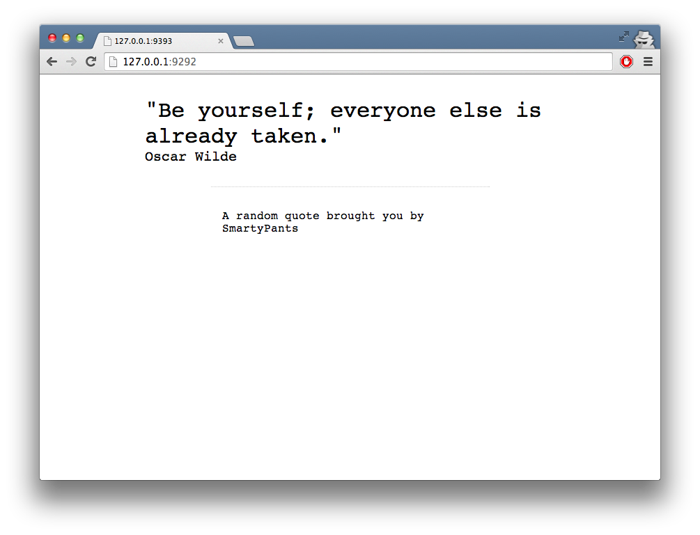

## Iteration 2

Now where you're familiar with the basic concepts of Docker images, it's time to build a real app.


### Smartypants

Let me introduce you to Smartypants, an app that posts a random quote on each reload.



#### Scope

Our goal for iteration 2 is, to pack this app into a Docker container and get it running locally. 

To keep things simple, the first version of this app is fully self-contained and does not depend on other services. The obvious drawback: The quotes are static. But we'll fix that later.

#### Prepare

You should have cloned the app already, in case you haven't, please do it now: https://github.com/harbormaster/smartypants

Time to get things rolling. Check out the Git tag ```iteration-1``` and take some time to explore the app.

Hint: The most interesting parts are ```Dockerfile``` and ```smartypants.rb```

```
git checkout iteration-1
```

#### Dockerfile

As you might have seen, we have a pretty simple Dockerfile already:

```
FROM harbormaster/ruby:latest

ADD . /app/
WORKDIR /app/
```
A Dockerfile is pretty much like a Makefile for containers. In this case, it takes the ```harbormaster/ruby:latest``` image as base image and copies the current working directory into the container (under ```/app```).

One interesting thing to know about Dockerfiles: Each step equals to a separate commit to the resulting Docker image and therefore will be cached for the next time you'll build the file. This is beneficial when you have expensive build steps in your Dockerfile.

You can find a full reference for the Dockerfile [here](http://docs.docker.io/en/latest/reference/builder/)

#### Build

Alright, let's build a container. SSH into the Vagrant box and go into the synced directory.

```
cd /vagrant
```

And build a container (Please replace ```<YOUR-NAME>```)

```
docker build -t playground/smartypants:<YOUR-NAME> .
```

Sweet, now we've packed the app into the ```playground/smartypants:<YOUR-NAME>``` image. When you're familiar with Ruby, you might have guessed the next step already: Bundling.

```
docker run --name=smartypants playground/smartypants:<YOUR-NAME> /bin/bash -c 'bundle install'
```

And commit your work:

```
docker commit -a '<YOUR-NAME>' -m 'Bundle' 850b14adad9c playground/smartypants:<YOUR-NAME>
```

#### Run

Now you're able to run a copy of your app wherever you want. Let's try:

```
docker run -d playground/smartypants:<YOUR-NAME> /bin/bash -c 'bundle exec rackup config.ru'
```

Note: ```-d``` runs the container as daemon. 

#### PS

List running containers with ```docker ps```

```
docker ps
CONTAINER ID        IMAGE                              COMMAND                CREATED             STATUS              PORTS                    NAMES
2daef85e0048        playground/smartypants:skorfmann   /bin/bash -lc 'bundl   23 minutes ago      Up 23 minutes                                happy_davinci
92d84e68e238        crosbymichael/dockerui:latest      ./dockerui -e /docke   10 hours ago        Up 9 hours          0.0.0.0:9000->9000/tcp   cranky_bell
```

Another way to inspect what's going on is the [DockerUI](http://192.168.33.10:9000).

#### Excercise 

* Find the IP address of the app container and try to access it.
* Make it accessible to your browser
* Make the previous steps repeatable (via Dockerfile)

Hint:

- ```docker inspect``` might help
- The default port for Sinatra apps is ```9292```

